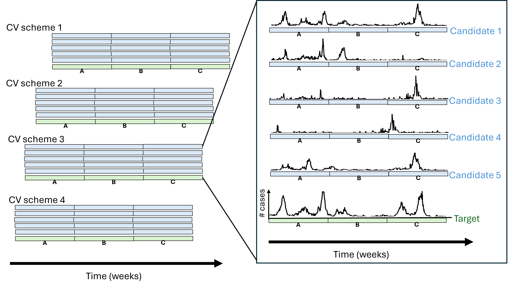
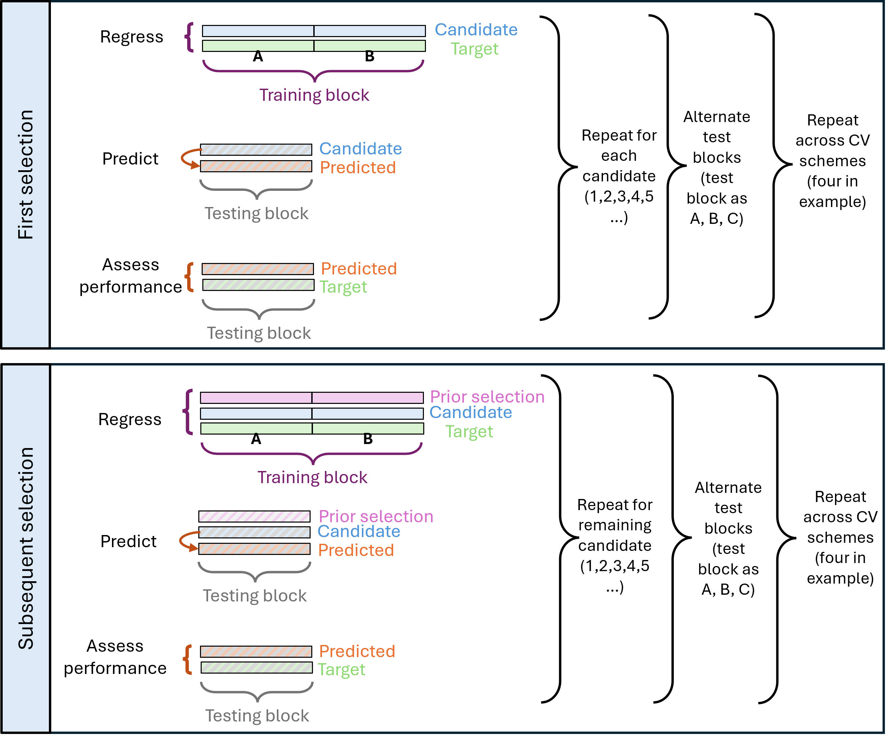

```{r, include = FALSE}
knitr::opts_chunk$set(
  collapse = TRUE,
  comment = "#>"
)


cat('<h4 style="font-size:0.9em;"><b>Figure 1</b></h4>')
cat('<h4 style="font-size:0.9em;"><b>Figure 2</b></h4>')
cat('<h4 style="font-size:0.9em;"><b>Figure 3</b></h4>')
cat('<h4 style="font-size:0.9em;"><b>Figure 3</b></h4>')
cat('<h4 style="font-size:0.9em;"><b>Arguments</b></h4>')
cat('<h4 style="font-size:0.9em;"><b>Returns</b></h4>')
cat('<h4 style="font-size:0.9em;"><b>Usage</b></h4>')


#cat('<h5 style="font-size:0.8em; font-weight: normal;">Simplified version to demo</h5>')
cat('<h5 style="font-size:0.8em;"><b>Create cv_scheme using the Peru dengue data</b></h5>')
cat('<p style="font-size:0.8em; margin-top:1em;">Simplified version to demo</p>')


```


## Introduction
The purpose of this package is to help find a set of areas that look like the epidemic pattern of a target location — for example, when choosing comparison areas to evaluate an intervention or when designing a sentinel surveillance network. Under the hood, it does this efficiently by combining potential control areas in a weighted way that best matches the target area, using a stepwise cross-validation approach. 


Potential use-cases include the following:

* Identify control areas as counterfactuals for evaluating the impact of area-level interventions (e.g. select a group of counties that can best serve as a control for a county implementing a vector-control strategy to estimate the effect)
* Select surveillance areas representative of epidemic patterns of target surveillance area (ex. select a set of hospitals or clinics as sentinel surveillance areas that best represent a state's epidemic patterns)

## Summary of methods
The package optimizes a method developed by @Scarpino2017 which utilizes a stepwise cross-validation algorithm based on multivariate linear regression models and out-of-sample predictive performance. Briefly, we generate cross-validation (CV) schemes by splitting the time series data into blocks and assigning labels. The blocks for each CV scheme are slightly shifted so that based on a randomly generated start time for the first block. 

For each CV scheme, we use each block once as the testing set while the remaining blocks serve as the training set. Using the training block, we run a regression for each candidate area where the response variable is the time series of cases for the target area and the explanatory variable is the time series of cases for the candidate area. We then apply the coefficients from the regression using training data to the testing block of the candidate area to predict the values for the testing block of the target area. We then assess the performance. In this example, we use squared Pearson correlation (corr²) to quantify how well the cases predicted from cases of control areas matches the observed case time series in the target area. Values of corr² range from 0 to 1, where values closer to 1 indicate stronger predictive performance and values closer to 0 indicate weak performance. We choose the best-performing candidate. We then select the next candidate using a greedy selection process. In this process, we find the next candidate that provides the best performance when combined with the previously-selected best-performing area, adding the one that maximizes out-of-sample performance. The process repeats, each time adding the new best candidate area to the model, until the specified number of areas is chosen. Once added, previously selected candidates are fixed and not re-evaluated in subsequent steps.

We repeat this entire process for each of the CV schemes generated over many iterations. Different CV schemes can produce different selected candidates because the start and end points of each block is shifted by a random amount. Each iteration produces a different set of CV schemes. We then choose the top performing candidates over multiple CV schemes and iterations. 

This approach has several advantages compared to other common approaches such as Principal Component Analysis (PCA), clustering (ex. k-means clustering) and elastic net. These methods do not generate out-of-sample predictions for the target area's case time series. PCA identifies shared temporal patterns that explain the most variance across potential control areas. Clustering groups areas with similar epidemic patterns based on a distance or similarity measure. Elastic net uses in-sample predictions to evaluate weighted combinations of potential control areas, but does not assess out-of-sample predictive performance. Overall, this approach provides a more robust and interpretable way to identify representative control areas by directly optimizing out-of-sample predictive performance over time.

## Getting Started/Installation
You will need to install the package from GitHub using the `devtools` package. Make sure you have the appropriate versions of`tidyverse` (>= 2.0.0), `Rcpp` (>= 1.0.13) installed as these are required dependencies.  

```{r}
#If you don't already have devtools installed:
#install.packages("devtools")

#Then install the package from GitHub
#devtools::install_github("cliu822/cvEpicurveSelect")

#load package
library(cvEpicurveSelect)

#load tidyverse for data wrangling
library(tidyverse)
```


## Data Input
To use the selection functions in this package, the following are the necessary input data:

* **Target time series**:  A numeric vector of length *t*, representing case counts for the target location at uniform time intervals (e.g. weekly)
* **Candidate matrix**: A numeric matrix with *t* rows and *c* columns, where each column corresponds to the time series of cases for a candidate location (excluding the target). The rows must be aligned in time with the target time series. 

Examples from this package use data from OpenDengue (Source: @opendengue2025). We use weekly data on dengue cases from Peru reported between 2000 to 2023. The data is stratified by administrative level 2 or the province.  We load the data below.

```{r}
data("peru_dengue")

head(peru_dengue)
```

For this example, we will use Lima province as the target area and the remaining provinces in Peru as candidate areas. Therefore, the question we are trying to address is: which of the remaining 115 provinces, when weighted in linear combination, can best replicate the historical epidemic trajectory of dengue experienced by Lima province?

### Create the target time series
The target time series (`goal_vec`) is a numeric vector containing weekly dengue case counts for the selected target area (Lima province). It is the epidemic pattern we want to replicate using other provinces.The candidate matrix must align in time with the target time series, with each row representing the same time period as the corresponding element of the target vector.


```{r}
#Create target time series
goal_name <- "LIMA" ##Make sure the goal name matches exactly how it appears in the dataset (Ex. all caps for "LIMA")

#goal_vec is the weekly dengue case countrs for the target area (Lima province)
#peru_dengue_pre2023 <- peru_dengue[peru_dengue$calendar_end_date <=as.Date("2022-06-01"),]
peru_dengue_pre2023 <- peru_dengue[peru_dengue$year<2022,]
goal_vec <- peru_dengue_pre2023[peru_dengue_pre2023$adm_2_name==goal_name, "dengue_total"]

#view first few values
head(goal_vec)

#goal_vec<-peru_dengue[peru_dengue$adm_2_name==goal_name, "dengue_total"]

peru_dengue_pre2023%>%
  filter(adm_2_name=="LIMA")%>%
ggplot()+
  geom_line(aes(x=calendar_start_date, y=dengue_total))
```

### Create the candidate matrix
The candidate matrix (`candidate_mat`) contains weekly dengue case counts for all other provinces. Each column corresponds to a candidate province and each row to a week. They must be aligned in time with `goal_vec` where the rows correspond to the vector position


```{r}
candidate_mat <- peru_dengue_pre2023%>%
                  mutate(adm_2_name = gsub("\\s+", "", adm_2_name))%>%
                  filter(adm_2_name!=goal_name)%>%
                 select(calendar_start_date, adm_2_name,dengue_total)%>%
                  pivot_wider(names_from = "adm_2_name", values_from ="dengue_total")%>%
                  select(-calendar_start_date)%>%
                  as.matrix()
```

## Key functions
This package contains three main functions:

 1) `make_cv_schemes()`: Creates cross-validation (CV) labeling schemes from time-series data that will be used in training and testing.
 2) `eval_candidates_rcpp()`:  Evaluates each candidate area by fitting a linear regression model to predict case counts in a target area using cross-validation. 
 3) `greedy_select_candidate()`: Selects candidate areas using a greedy selection algorithm by comparing the out-of-sample corr² averaged across test blocks and cross-validation schemes.

### **make_cv_schemes()**



#### *Figure 1* 
Illustration of the generation of cross-validation (CV) labeling schemes from time series data using the function `make_cv_schemes()`. In the example, there are 5 candidate areas and 1 target area and we are generating 4 different CV schemes with three blocks for each. Each of the 4 CV schemes are shifted in time so that each block captures a different time period. 


#### *Arguments*

* `tot_ts`: Total number of time points (e.g., total weeks of data)
* `n_cv_schemes`: Number of different CV block labeling schemes to generate.
* `block_length`: Number of years per block (default: 3). Each block is used as a test set once.
* `freq`: Number of time points per year (e.g., 52 for weekly data).

#### *Returns*
A list of CV labeling schemes. Each element corresponds to a different scheme, assigning a block label (e.g., "A", "B", "C") to each time point. 


#### *Usage*

**Simplified version to demo**

Here we specify 200 time steps and four CV schemes where each block is 1 year each. This results in three block labels of 1 year each with some time steps unused at the beginning and end of time series. The number of blocks is determined by dividing the total time step steps by the length of the block. In our case, this is our pre-specified 200 weekly time steps divided by our pre-specified 52 weeks per block (or one year). 

```{r}
# set random seed for reproducibility for the randomly selected starting point of each CV scheme
set.seed(1234)

cv_schemes_simp <- make_cv_schemes(tot_ts = 200, n_cv_schemes=4, block_length=1, freq=52)
unique(cv_schemes_simp[[1]]) ##Three block labels of 1 year each
```

We can assess the the first two CV schemes and see that the block labels are shifted.
```{r}
cv_schemes_simp[[1]]
```

```{r}
cv_schemes_simp[[2]]
```

**Create CV schemes using the Peru dengue data**

Here we specify that the number of time steps as the total number of time steps available in our dataset using `length(goal_vec)` (1252 time points) and that the length of blocks are 4 years each. This results in a total of 6 blocks or 6 unique block labels. 

```{r}
# set random seed for reproducibility for the randomly selected starting point of each CV scheme
set.seed(1234)

cv_schemes <- make_cv_schemes(tot_ts = length(goal_vec), n_cv_schemes = 4, block_length = 4, freq = 52)
unique(cv_schemes[[1]]) ##Six blocks of around 4 years each

```


### **eval_candidates_rcpp()**


#### *Figure 2* 
Illustration of the process for evaluating a single candidate area implemented by the function `eval_candidates_rcpp()`. We first choose one of the blocks as the test block and the remaining as training (2a). We then regress using the training blocks, predict using the test blocks and assess the performance using the corr² metric. We rotate the test blocks (three in example), repeating the process of regressing, predicting and accessing performance. We then repeat across all the CV schemes (four in example) and all candidate areas (five in example) (2b). The candidate with the best performance metric averaged across all blocks and CV schemes will be selected. 


#### *Arguments*

* `goal_vec`: A vector of time-stratified (e.g., weekly) cases in the target area.
* `candidate_mat`: A matrix of cases in candidate areas (time units × candidate areas).
* `block_labels`: A character vector of block labels for a single cross-validation scheme.
* `unique_blocks`" A character vector of unique block labels from the generated CV schemes.
* `previously_selected`: An integer vector of indices of previously selected areas.
* `candidate_names`: A character vector of candidate names.

#### *Returns*

A list with:

* `corr²`: A vector of corr² values for each (block × candidate).
* `selected`: A vector of candidate names corresponding to each corr².
* `oos_est`:A matrix of out-of-sample predictions (same shape as `candidate_mat`).

#### *Usage*
```{r}
res_cand <- eval_candidates_rcpp(goal_vec = goal_vec,            #Target time series (vector)
                    candidate_mat=candidate_mat,                 #Matrix of candidate predictors (time units x candidate areas)
                    block_labels=cv_schemes[[1]],                #Vector of a single CV block labels
                    unique_blocks = unique(cv_schemes[[1]]),     #Unique block labels
                    previously_selected = integer(0),            #Vector of indices of previously selected candidates, 0 means none selcted
                    candidate_names = colnames(candidate_mat))   #Vector of candidate names

```

The first six `corr²` correspond to the `corr²` metrics of the first six candidates resulting from the first block as testing. The range for this value is [0,1].  In this example, the first six `corr²`values are 0 because there were no dengue cases in the target area (in our case Lima) in the held out block. In these situations, our code assigns the `corr²` as 0 in the `eval_candidates_rcpp()` function. 
```{r}
res_cand[[1]][1:6]
```

The first six `selected` correspond to the first six candidates.
```{r}
res_cand[[2]][1:6]
```


### **greedy_select_candidate()**


#### *Figure 3* 
Illustration of the process of selecting `n_select` candidate areas, using the greedy selection algorithm. In each step, the algorithm selects the option that offers the best improvement without reconsidering past decisions. At each step, the function evaluates which additional area, when added to the exsiting selections, maximizes the squared correlation (corr²). The previously selected candidates are fixed and are not reconsidered or removed in subsequent steps. In cases of ties, the best candidate is selected at random between the tied candidates. 

#### *Arguments*

* `goal_vec`: A vector of time-stratified (e.g., weekly) cases in the target area.
* `candidate_mat`: A matrix of candidate cases (time units × candidate areas).
* `cv_schemes`: List of length `n_cv_schemes`, each element is a vector of block labels (e.g., "A", "B", "C") of `tot_ts`. This is the output of `make_cv_schemes()`.
* `n_select`: Number of candidates to select.
* `rcpp`: Boolean of whether to use Rcpp compiler function or R function to evaluate candidates.


#### *Returns*

A list with:

* `selected_areas`: A vector of `n_select` selected areas.
* `corr2_per_step`: A vector of performance corr² with each additional selection.

#### *Usage*
```{r}
res_sel <- greedy_select_candidate(goal_vec=goal_vec, #Target time series (vector)
                        candidate_mat=candidate_mat,  #Matrix of candidate predictors (time units x candidate areas)
                        cv_schemes = cv_schemes,      #List of CV schemes
                        n_select=5)                   #Number of candidates to select
```


The five selected areas are as follows with the incremental `corr²` values displayed below. 
```{r}
res_sel$corr2_per_step
```


* The candidate area that was selected first is `r names(res_sel$corr2_per_step)[1]` with an average `corr²` across all test blocks and all CV schemes of `r round(res_sel$corr2_per_step[[1]], 3)`
* After `r names(res_sel$corr2_per_step)[1]`, the candidate area that was subsequently selected is `r names(res_sel$corr2_per_step)[2]` and when linearly combined with `r names(res_sel$corr2_per_step)[1]`, the average `corr²` is `r round(res_sel$corr2_per_step[[2]], 3)`.

## Full example

In practice, we will run many iterations of the algorithm and then select the best performing candidates. We again use the Peru dengue data in our example and the province of Lima as the target, with remaining provinces as the candidate areas.


#### Run over many iterations
```{r message=F}
nit <- 20  ##Number of iterations
n_sel<-5    ##Number of municipalities to select
sel_mat <- matrix(NA,ncol=n_sel,nrow=nit)
corr2_mat    <- matrix(NA,ncol=n_sel,nrow=nit)

for(j in 1:n_sel){       
  for(i in 1:nit){
    cv_schemes_new<-make_cv_schemes(tot_ts=length(goal_vec),n_cv_schemes = 10,block_length=4)
    nets <- greedy_select_candidate(goal_vec=goal_vec, candidate_mat=candidate_mat, cv_schemes = cv_schemes_new, n_select=j)
    sel_mat[i,j]     <- nets[[1]][j]
    corr2_mat[i,j]         <- nets[[2]][j]
  }
}

```

#### Summarize results
```{r}
sel_vec <- order_select(sel_mat)[1:n_sel,"Area"]   ##Choose the n_sel number of most commonly selected areas
sel_cases <-as.data.frame(candidate_mat[,sel_vec]) ##Get the cases from those candidate areas

print(sel_vec)
```
#### Use the selected candidates to predict the target
We use time series of cases from the selected candidate area to predict the time series of cases from the target area using multivariate linear regression.

```{r}
res_pred <- pred_targ(goal_vec, sel_cases)   ##Use the selected candidates to predict the target

res_pred$corr2
```

The overall `corr²` is **`r res_pred$corr2`**.

#### Visualize the predicted vs target
```{r fig.width=7, fig.height=4, echo=TRUE, message=FALSE, warning=FALSE}

data.frame(Week = 1:length(goal_vec),
           Actual = goal_vec,
           Predicted = res_pred$pred)%>%
  
  pivot_longer(cols = c("Actual", "Predicted"), names_to = "Type", values_to = "Cases")%>%
  #filter(Week<=688)%>%
  mutate(Date = as.Date("2000-01-02") + weeks(Week - 1))%>%
  
  ggplot()+
  scale_x_date(date_breaks = "1 year", date_labels = "%Y") +
  geom_line(aes(x = Date, y = Cases, color = Type),size = 1) +
  
  labs(title = "Actual vs. Predicted (Lima)",
       x = "Week",
       y = "Cases") +
  theme_minimal()+ guides(color = guide_legend(title = NULL))+
  theme( legend.position = "bottom", legend.direction = "horizontal", legend.box = "horizontal",
         axis.text.x = element_text(angle = 45, hjust = 1))
```
#### Map of selected control areas

#### Controlled Interrupted Time Series for hypothetical intervention
After control areas are selected, we can run various analysis of interest. For example, if we would like to estimate the effect of an intervention implemented at a specific time point `t`, we can use a Controlled Interrupted Time Series (CTIS). 

Below we consider a hypothetical intervention implemented on January 2023. We consider the time period before 2023 as the pre-intervention period and 2023 as the post-intervention period. 

```{r}
##y = vector of target time series 
##X = matrix of time series of selected candidates

peru_dengue <- peru_dengue%>%filter(year<2023)
y <- peru_dengue[peru_dengue$adm_2_name==goal_name, "dengue_total"]

X <- peru_dengue%>%
                  mutate(adm_2_name = gsub("\\s+", "", adm_2_name))%>%
                  filter(adm_2_name!=goal_name)%>%
                 select(calendar_start_date, adm_2_name,dengue_total)%>%
                  pivot_wider(names_from = "adm_2_name", values_from ="dengue_total")%>%
                  select(-calendar_start_date)%>%
                  select(sel_vec)%>%
                  as.matrix()  
t_int=1148
t_pre <- seq_len(t_int - 1)

#y[t_int:length(y)] <- 0.05 * y[t_int:length(y)]

##Fit pre-period linear model to get weights 
fit_pre <- lm(y[t_pre] ~ 0 + as.matrix(X[t_pre, , drop = FALSE]))  # no intercept -> pure weights
w <- coef(fit_pre)
w[is.na(w)] <- 0


Tn <- length(y)
post <- as.integer(seq_len(Tn) >= t_int)
time <- seq_len(Tn)

# Construct control over full period
control_df <- data.frame(Yt=drop(as.matrix(X) %*% w),
                         T=time,
                         Xt=ifelse(time<t_int,0,1),
                         G=0)
##Center time at the intervention
#t_center <- time - (t - 1)
#post_t   <- post * t_center

int_df <- data.frame(Yt = y, 
                     T = time,
                     Xt=ifelse(time<t_int,0,1),
                     G=1)

dat<- bind_rows(control_df,int_df)
dat <- dat%>%
        mutate(T_Xt = T*Xt,
               G_T  = G*T,
               G_Xt = G*Xt,
               G_Xt_T=G*Xt*T)

fit <- nlme::gls(
      Yt ~ T +Xt+T_Xt+G+G_T+G_Xt+G_Xt_T,
      #Yt ~ T +Xt+T_Xt+G+G_T+G_Xt,
      data = dat,
      correlation = nlme::corARMA(p = 1)
    )
cf <- summary(fit)$tTable

freq=52
fit <- lm(Yt ~ T +Xt+T:Xt+G+G:T+G:Xt+G:Xt:T,data = dat)
    # lag selection: roughly seasonal? set lag = round(freq/4) as a mild default
lagNW <- max(1L, round(freq / 4))
vc   <- sandwich::NeweyWest(fit, lag = lagNW, prewhite = FALSE, adjust = TRUE)
ct   <- lmtest::coeftest(fit, vcov. = vc)


ggplot(dat, aes(x = T, y = Yt, color = as.factor(G))) +
  geom_point(alpha = 0.6) +
  geom_vline(xintercept = t_int, linetype = "dashed", color = "red") +
  labs(
    title = "Interrupted Time Series: Lima vs Weighted Control",
    x = "Time", 
    y = "Outcome",
    color = "Group"
  ) +
  scale_color_manual(
    values = c("0" = "darkgray", "1" = "steelblue"),
    labels = c("0" = "Weighted Control", "1" = "Lima")
  ) +
  theme_minimal()

```


## Selecting values for parameters
* We recommend using a minimum of three blocks. With fewer than three blocks, the cross-validation becomes a single train-test split which limits the model's ability to generalize across multiple, potentially distcint temporal phases in the data. 
* We also recommend at least 1 year of observations for each block so that each block contains sufficient temporal variation. This is especially important for infections like dengue with seasonal epidemic patterns.Larger blocks each with more years of data may be beneficial if there is more heterogeneity between years in the time series. 

##Common pitfalls
* Missing values in the time series data should be avoided for both the target area and candidates area. Missing values in a specific training block will result in an NA for performance metric for that block and may bias the selection.  

## Future work
* In future package versions, we will consider allowing performance to be evaluated using other metrics such as the Mean Absolute Error (MAE) and the Root Mean Squared Error (RMSE)

## References
